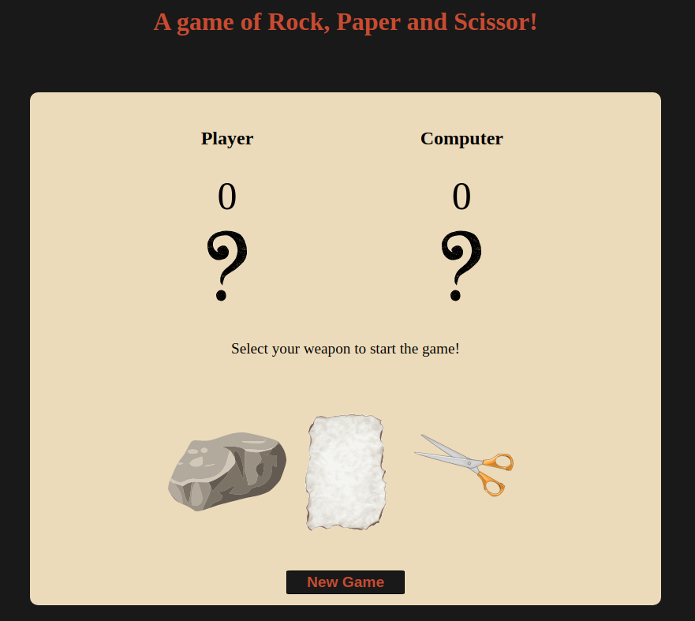

# Rock Paper Scissor

This project is part of [The Odin Project](https://www.theodinproject.com/paths/foundations/courses/foundations/lessons/rock-paper-scissors) foundations curriculum.

## Description

This implementation of the Rock Paper Scissor game is played against the computer on the web browser.

## Rules

Both the player and the computer play until one of them reaches 5 wins.
The game follows the [Rock Paper Scissor](https://en.wikipedia.org/wiki/Rock_paper_scissors) rules were:
* Rock beats Scissor
* Paper beats Rock
* Scissor beats Paper

## Built with

* HTML
* CSS
* Javascript

## Play

[Github Pages](https://rmg92.github.io/odin_project_rockpaperscissors/)

## What I Learned

*  How to interact with the code via the browser console
*  How to understand errors
*  How to use Javascript Functions
*  How to manipulate the html/css elements with javascript
*  How to work with Git branches

## Acknowledgments

* [The Odin Project](https://www.theodinproject.com/)
* [Github](https://github.com/)